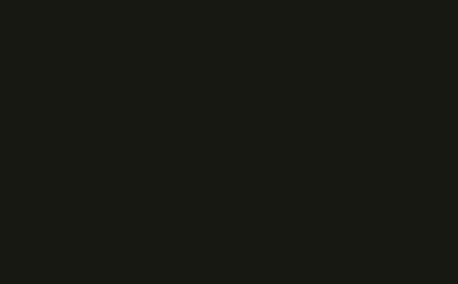

# rotating-3d-model

> A live, auto-rotating 3D PBR model that changes daily, with offline fallback.

A self-contained widget for [Übersicht](http://tracesof.net/uebersicht/). The
entire widget lives in `index.jsx` (the shared design system is inlined), so it
runs on any Mac with no extra files beyond the bundled assets.

## Install

1. Install and run [Übersicht](http://tracesof.net/uebersicht/).
2. Unzip `rotating-3d-model.widget.zip`, or copy the `rotating-3d-model.widget` folder into your
   Übersicht widgets directory:
   `~/Library/Application Support/Übersicht/widgets/`
3. Refresh Übersicht (menu bar icon -> Refresh All).

## Notes

- Needs a network connection: the viewer script and most models load from CDNs.
- Falls back to the bundled model when offline.
- Optional: install the Instrument Serif and Geist font families for the intended typography; system fonts are used as a fallback.

## How to edit

Edit the MODELS array in index.jsx to change the rotation set.

All visual styling (colors, fonts, the card shell, drag/resize handles) is in
the inlined design-system block at the top of `index.jsx`.

## Bundled files

- `index.jsx`
- `winged-victory.glb`

## Submitting to the Übersicht gallery

Create a public GitHub repo with `widget.json`, `rotating-3d-model.widget.zip`, and a
258x160 (or 516x320 hi-res) `screenshot.png`, then
[open an issue](https://github.com/felixhageloh/uebersicht-widgets/issues) with the URL.

## Author

Jalen Edusei <jalen.edusei@gmail.com>
